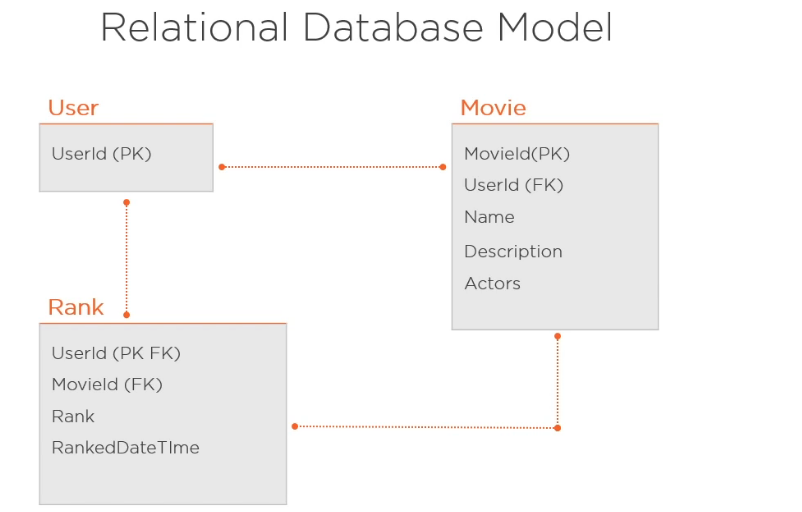
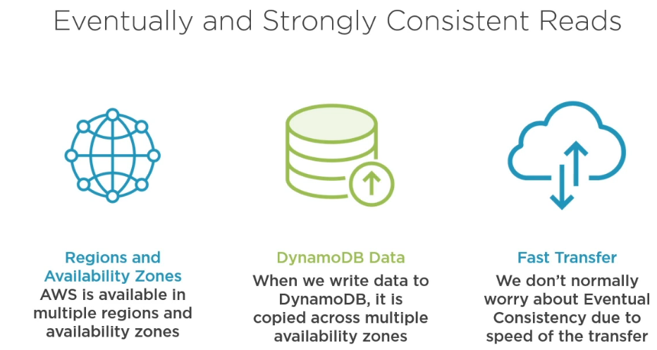
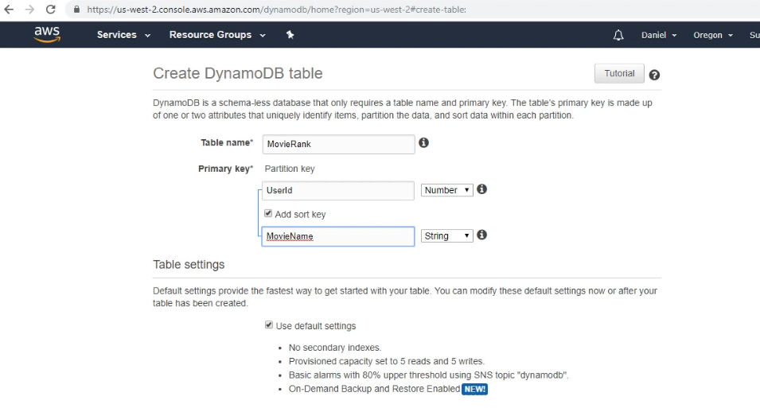

# Dotnet_Dynamodb

## Dyanmodb

- fully managed NoSQL database
- store and retrive massiave amounts of data
- Horizantal scalability
- on-demand backups

## Dynamodb free tier

https://aws.amazon.com/free

- 25 db per month data storage
- 200 million requests per month (25 WCU and 25 RCU)
  - WCU : write capacity units
  - RCU : read capacity units
- ability to deploy dynamodb global tables in up to two regions (good for disaster recovery)

## Types of NoSQL DBs based on specific needs / usecases

- Key-Value Store : good for horizantal scaling
- Document Store : similar to key-value store. it stores key as a unique identifier for the value. the difference is that here the value contains stuctured or semi structured data(json)
- Column Store : data stored in cells that is grouped together, rather than in rows like above two. this store uses a concept called 'key space', a key space is like a schema in relational model. columns are logically grouped into column groups.
- Graph base : collection of edges and nodes. a node is an entity such as person, place or object and edges is a relationship between 2 nodes

## Dynamodb is both key-value and Document based database

- you store collection of keys and its associated values to those keys > good for scaling
- dynamodb is also document based. it supports JSON can be written to dynamodb table

## SQL vs NoSQL

- Relational db:
  - it is organized into tables with predefined relationships
    
- Non-Relational db:
  - a way to model data that is used to store and retrieve in a non-relational way
    

## Dynamodb Core components

- each table contains 0 or more items. Items=rows
  
- partition key = hash key
- all items with same partition key stored together = item collection
- sort key used inconjunction with partition key. sort key allows you to query data which is related to partion key. can use filters like "beginswith, between, >, <,..."
  
- each table created must have primary key
- primary key = based on partition key
- composite primary key = based on partition key + sort key
- if you only use partiton key as primary key the it must be unique, if you use composite primary key the both Partition key and sort key combination must be unique
  

## Secondary Indexes

- To Efficienty find you data : query data using an attribute that is not your primary or composite primary key
  - dynamodb offers a way to achieve this usinf secondary indexes
  - can create secondary index with different sort key based on partition key kept while setting up table
  - or can create different partiton key and optional sort key
- Local Secondary index
  - use the same partition key but different sort key
  - max limit 5 per table
- Global secondary index
  - specify a different partiton and optional sort key
  - max limit 5 per table
- indexes increases store and input output costs
  

## Creating a Data model and table with DynamoDB





- for items larger than above limit, dynamodb comsumes additional RCU, WCU
- RCU, WCU for table and secondaru indexes
  

- read and write consumption rate
  

## Retrieve data using SCAN & QUERY

- when using scan function dynamodb reads all items in in the table, you can optionally add filter to filter the items but all items need to be read. takes long time and cost by table size.
- query functions are efficient. you should use partition key, sorty key or secondary indexes
- QUERY functions is faster than SCAN because in query function search based on key and items are grouped together based on partition key
- always try use QUERY


- scan filter
  
  
  

- query filter
  
  

- query filter on secondary index
  
  

# Setting Up ASP.NET Core web application


- create ASP.NET Core empty template web app
- MovieRank web app:
  > install-package awssdk.dynamodbv2 \
  > install-package awssdk.extensions.netcore.setup
- MovieRank.Lib project
  > install-package awssdk.dynamodbv2 \
  > install-package awssdk.extensions.netcore.setup
- create IAM role

  - IAM role allows you to create credentials that can be used outside aws console to gain access to services in aws account
  - aws portal > search IAM > users > add user
    
    
    
    
    
    
    
    

- Install aws cli https://aws.amazon.com/cli/
  > aws --version
  - no add aws credentials in credentials file which is used by dynamodb client inside the .net application to gain access to aws and intereact with dynamodb
    > aws configure \
    > Access ID:\
    > Secret Key:\
    > Default Region: us-west-2
  - now, confih, credentials files will be created in "Users\skan\.aws" folder
  - use created IAM user credentials
    

# .Net SDK 3 models

## 1. Object persistance model

- wrapper around low level model
- easiest model to code aganist
- map client-side classes to our dynamodb table. each object instance then maps to item in correspoding table
- can do most things with is model but missing features like ability to create, update, delete dynamodb table

  

- overall ranking is by taking all users ranking and take average

## 2. Document model

- also a wapper around low level model
- in this model, table and document are primary classes
  - table class: to PUT, GET, DELETE items
- can use SCAN and QUERY with this model
- requires little more code than object persistence model
- here also cannot create, update, delete dynamodb tables

## 3. Low level model

- wraps directs calls to dyanmodb service
- gives us all features, including ability to create, update and delete tables
- requires to write significant amount of extra code

  

# Testing

- use local dynamodb test instance to run tests instead of aws instance. it has a docker image
  

* https://docs.docker.com/desktop/install/windows-install/
  > docker --version

> install-package microsoft.aspnetcore.testhost\
> install-package microsoft.aspnetcore.all

- local dynamodb image can be pulled in C# code itself in test setup, or

> docker pull amazon/dynamodb-local
> docker run -d -p 8000:8000 amazon/dynamodb-local

- startup.cs

```
if (_env.IsDevelopment())
{
    services.AddSingleton<IAmazonDynamoDB>(cc =>
    {
        var clientConfig = new AmazonDynamoDBConfig { ServiceURL = "http://localhost:8000" };
        return new AmazonDynamoDBClient(clientConfig);
    });
}
else
{
    services.AddAWSService<IAmazonDynamoDB>();
}
```

-
